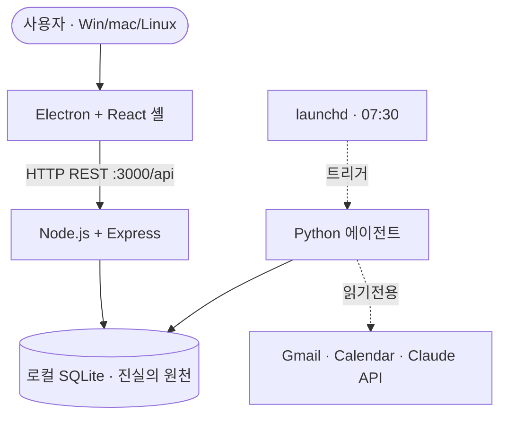

# 대시보드 OS — 개인 생산성 관리 시스템 개발 보고서

**작성자**: 이재엽 (Jaeyeup Lee)
**소속 과정**: 우송대학교 2026-2학기 — AI 컴퓨터 운영체제 실습 · AI시대 소프트웨어공학 · AITool 기반 소프트웨어공학
**수행 기간**: 2026-09-02 착수 · 2026-11-30 완료 목표 (본 보고서는 3주차 시점 중간 보고)
**저장소**: https://github.com/gamercross/my-setup-proj
**결정 기록**: ADR 35건 (결정 1건 = 파일 1건)

---

## 초록

본 프로젝트의 목적은 진척률을 보여주는 것이 아니라, 자신의 프로젝트와 경험에 흩어져 있는 지식을 시각화·도식화해 그 가치를 올리고, 축적된 지식이 역량으로 이어지는 방향을 한눈에 보이게 하는 데 있다. 자기계발을 더 효과적으로 만들고, 경험에 담긴 지식을 구체화해 가치를 형성하는 것이 목적의 근간이다. 이 목적을 위해 할일·프로젝트·일정·OKR·에이전트 활동·자기 점검 기록을 하나의 위젯 셸에 모으는 로컬 우선 데스크톱 대시보드를 설계·구현했다. Electron·React·Node.js·SQLite·Python 에이전트로 구성되며, 4역할(planner–developer–supervisor–finisher) 에이전트 파이프라인으로 전 기능을 개발했다. 본 보고서는 문제 정의, 아키텍처 결정, 개발 방법론, 시스템 설계와 그 한계, 구현 결과, 진행 현황을 순서대로 기록한다.

## 목차

1. [서론 — 문제 정의](#1-서론--문제-정의)
2. [설계 결정 및 근거](#2-설계-결정-및-근거)
3. [개발 방법론](#3-개발-방법론)
4. [시스템 설계와 한계](#4-시스템-설계와-한계)
5. [구현 결과](#5-구현-결과)
6. [진행 현황 및 향후 계획](#6-진행-현황-및-향후-계획)
7. [결론](#7-결론)

---

## 1. 서론 — 문제 정의

### 1.0 목적의 재정의 (2026-09-14)

본 프로젝트의 목적은 진척도를 보는 것이 아니다. 착수 시점부터 3주가 지난 시점에, 프로젝트를 이끌어 온 실제 목적이 다음과 같이 명확히 정리되었다.

> "우리의 목적은 진척도를 보는 것이 아닌 자신의 프로젝트나 경험들이 모인 지식을 시각화하고 도식화해서 지식 가치를 올리는 것. 지식들이 모여서 자신의 역량을 증진시키고 그 방향을 빠르게 한눈에 보이게 하는 것." · "목적의 근간은 자기계발을 더욱 효과적으로, 경험에 대한 지식을 구체화하고 가치 형성을 위해서 이루어진다." — 사용자 진술, 2026-09-14

이 프로젝트가 다루는 대상은 **완료율이 아니라 지식**이다. 할일·프로젝트·OKR·에이전트 활동은 전부 "무엇을 겪었고 그로부터 무엇을 알게 됐는지"가 흩어지지 않고 쌓이는 그릇이며, 그 축적이 자기계발·역량 증진으로 이어지는 방향을 한눈에 보여 주는 것이 궁극적 목적이다.

### 1.1 착수 당시의 문제 인식 (2026-09-09)

연구의 발단은 도구의 분산이 아니라 감각의 부재였다. 2026년 9월 9일 진행한 자기 인터뷰에서, 문제의 핵심은 다음 한 문장으로 정리되었다.

> "내가 뭐가 진척되는지 감이 안 와서." — 사용자 인터뷰, 2026-09-09

돌이켜 보면 이는 §1.0에서 정리된 더 근본적인 목적(지식의 시각화와 역량 방향 제시)이 가장 먼저 만져진 표면이었다. 이 감각의 부재는 세 영역 — 개인 삶·일, 공부·강의 진도, 프로젝트 개발 진도 — 에서 동시에 나타났으며, 이는 서로 다른 세 가지 불편이 아니라 지식이 쌓이는 자리가 셋으로 흩어져 있다는 하나의 근본 원인이 세 표면에 드러난 것으로 파악되었다. 이 통찰은 프로젝트의 메타 원칙으로 정식화되었다: **"이 저장소의 `PROGRESS.md`가 프로젝트에 해 주는 일 — 흩어진 작업을 하나의 지식 서사로 엮는 일 — 을, 앱이 사용자 자신의 경험에도 해 준다."**

더 이전의 출발점은 개인적 경험 기록의 어려움에 있다. 고등학교 시절부터 이어진 PC방 아르바이트, 영상 편집, 3년 연속 방송부 활동 등은 결과물이 아닌 경험으로 남았고, 이를 시각화·정리할 공간의 부재가 포트폴리오 제작 시도로 이어졌다. 초기에는 Notion으로 작업 대시보드를 구성했으나, 파일 규모가 커지면서 정리가 무너졌다. 이 경험은 "혼자서 생각 → 행동 → 기록 → 정리를 모두 해내는 과정 자체가 지나치게 어려운 작업"이라는 판단으로 이어졌고, 이것이 본 프로젝트 착수의 직접적 동기가 되었다.

### 1.2 파생 문제 (Q1–Q8)

중심 문제로부터 8개의 구체적 불편이 도출되었으며, 사용자 확인 결과 전부 실제 경험과 부합했다. 이 중 Q3·Q4·Q5·Q7은 지식 가시화(당초 "진척 가시성"으로 불렀던 묶음)라는 공통 축으로 묶인다.

| # | 파생 문제 | 묶임 |
|---|---|---|
| Q1 | 생산성 도구가 앱마다 분산돼 있다 | 통합 |
| Q2 | 우선순위 정리를 매일 수동으로 판단한다 | 자동 정리 |
| Q3 | 같은 할 일이 여러 뷰에서 따로 논다 | 진척 가시성 |
| Q4 | 정리·분류가 전부 수동이다 | 진척 가시성 |
| Q5 | 에이전트의 작업이 눈에 보이지 않는다 | 진척 가시성 |
| Q6 | 화면 배치가 사용자별로 고정돼 있다 | 개인화 |
| Q7 | 프로젝트 구조·진행을 앱 안에서 확인할 수 없다 | 진척 가시성 |
| Q8 | 시각적 완성도가 임시적이다 | 완성도 |

### 1.3 제약 조건

개발은 다음 제약 아래 진행되었다: 개발자 1인(C-1), 마감 2026-11-30(C-2), 강의 A 진도 종속(C-3), 인프라 비용 0원 목표(C-4), 학습·발표 산출물 겸용(C-5), 공개 저장소이므로 시크릿·개인정보 커밋 금지(C-6). 배포 목표는 Windows·macOS·Linux 3-OS이며 오프라인 조회 동작이 필수 요건이다.

---

## 2. 설계 결정 및 근거

모든 아키텍처 결정은 결정 1건당 문서 1건(ADR)으로 기록했으며, 현재 35건이 누적되었다. 각 ADR은 맥락·결정·근거·대안·결과 5개 필드로 구성된다.

### 2.1 기반 스택

프론트엔드는 React·Vite로 통일하고, 로컬 저장소는 better-sqlite3(WAL 모드)를 채택했다. 프론트-백엔드 통신은 로컬 HTTP REST로 고정했으며, 외부 API(Gmail·Calendar·Notion·Claude)는 Python 에이전트가 읽기 전용으로 전담한다. 데스크톱 크로스플랫폼 배포를 위해 Electron을 의식적으로 선택했다 — 산출물은 웹이 아니라 "앱"이어야 한다는 것이 사용자의 명시적 요구였으며, 웹 데모는 어디까지나 발표용 미리보기로 구분된다.

### 2.2 대시보드 OS 전환

초기 고정 패널 구조(`Dashboard.jsx` 단일 컴포넌트)가 비대해지고 사용자별 배치가 불가능해지자, react-grid-layout 기반 위젯 셸 아키텍처로 전환했다. 이 투자는 제품 필요(사용자별 배치)와 "AI 컴퓨터 운영체제 실습" 강의의 요구(창·프로세스·포커스·레이아웃 관리 개념 실습)가 겹치는 지점에서 정당화되었으며, 사용자 갈망 목록에 위젯 커스터마이즈가 없었다는 사실은 이 투자가 제품 관점에서는 과했을 가능성을 시사한다(§6.3 재검토 참고).

### 2.3 결정 서사 — 자동 분류의 신뢰 문제

가장 오래 지속된 결정은 할 일 자동 분류 방식이었다. 표면적 질문은 "고정 카테고리 대 자유 태그"였으나, 실제로 논의를 지연시킨 것은 다음 우려였다.

> "에이전트가 내가 달아 둔 태그를 침범하면 어쩌지."

최종 결정은 자유 태그 조인 테이블에 출처 컬럼(`source ∈ {user, agent}`)을 두어, 에이전트가 사용자 태그를 절대 수정하지 않고 미분류 항목에만 개입하도록 하는 것이었다. 이 원칙은 §4.2에서 다시 다룬다.

### 2.4 OKR 채점 방식 확장

2026년 9월 14일, 구글 사내 OKR 운영 방식을 조사해 핵심 결과(Key Result)에 유형 구분(*committed* 약속형/*aspirational* 문샷형)과 등급 계산 함수를 추가했다. Committed 유형은 90% 이상을, aspirational 유형은 70% 이상을 초록 등급으로 판정하며, 이 결정은 ADR-0034로 기록되었다.

---

## 3. 개발 방법론

개발자 1인이라는 제약을 보완하기 위해, 모든 코드 작업을 4역할 에이전트 파이프라인 1회로 완성하는 절차를 수립했다.

```
planner (계획) → developer (구현) → supervisor (리뷰·검증, 최대 2회) → finisher (검증 게이트·커밋·푸시)
```

오케스트레이터는 직접 코드를 작성하지 않으며, 한 번에 하나의 역할만 활성화한다. 실행되어 실패한 검사가 있으면 커밋을 금지하고, 실행하지 않은 검사를 통과로 보고하지 않는다. 브랜치는 `feature/<주제>`로 분리해 PR을 거쳐 `main`에 병합하며, 병합은 사람이 최종 승인한다.

검증 게이트는 백엔드 단위 테스트, 프런트엔드 단위 테스트, 통합 스모크 테스트, 데모-실서버 경로 패리티 검사, 문서 정합 검사로 구성된다. 본 보고서 작성 시점의 최신 수치는 다음과 같다.

| 지표 | 값 |
|---|---|
| 채택된 ADR | 35건 |
| 백엔드 테스트 | 147건 |
| 프런트엔드 테스트 | 108건 |
| `verify.sh` 통과 | 49/49 |
| 문서 정합 검사 | 11/11 |
| 개발자 인원 | 1인 |

---

## 4. 시스템 설계와 한계

### 4.1 컨테이너 구조



핵심 원칙은 로컬 우선(local-first)이다. 로컬 SQLite가 진실의 원천이며, 외부 API는 그 위에 얹는 캐시로 취급한다. 렌더러는 시크릿과 Node API에 접근할 수 없고(`contextIsolation`), 모든 데이터는 REST 경로로만 흐른다.

### 4.2 알려진 한계

본 절은 2026년 9월 10일 코드 검토 시점의 판단이며, 구조가 아직 감당하지 못하는 지점을 정직하게 기록한다. 공통 원인은 로컬 단일 사용자·1인 개발이라는 가정이며, 다중 사용자 확장 시 재검토가 필요하다.

| 항목 | 내용 |
|---|---|
| **S1** | 인증 없는 로컬 네트워크 노출 — 백엔드가 전 인터페이스에 바인딩되어 같은 네트워크의 다른 기기에서 데이터에 접근할 수 있다. 루프백 고정으로 해결 예정. |
| **S3** | 태그 비침범 원칙이 코드 계층에서만 보장된다 — 데이터베이스 트리거가 아닌 애플리케이션 코드가 사용자 태그 보호를 담당한다. |
| **D1** | 데모-실서버 경로 패리티가 경로 존재 여부까지만 자동 검증된다 — 응답 스키마·상태 코드의 드리프트는 아직 탐지되지 않는다. |
| **D3** | 레이어 경계 규칙에 대한 자동 검사가 없다 — 렌더러-REST 전용, 에이전트 읽기 전용 원칙이 코드 리뷰에만 의존한다. |

대조적으로, 파일 트리·문서 열람 기능은 심링크 우회·경로 이중 인코딩 우회를 다층으로 방어하고 있어 같은 제약 조건 아래에서도 미뤄지지 않은 사례로 평가된다.

---

## 5. 구현 결과

각 기능은 §1의 파생 문제(Q1–Q8) 중 하나에 대한 구체적 응답으로 설계되었다.

| 기능 | 대응 문제 | 단계 |
|---|---|---|
| 할일 CRUD · 프로젝트 연동 | Q1 | 완료 |
| 위젯 셸 (배치·리사이즈·레이아웃 저장) | Q6 | 완료 |
| 단일 캐시 + 칸반 뷰 | Q3 | 완료 |
| 할일 자동 분류 (출처 구분 태그) | Q4 | 완료 |
| 에이전트 활동 위젯 + 즉시 실행 | Q5 | 완료 |
| OKR + 주간 플래너 (구글식 등급 포함) | Q4 | 완료 |
| 진행 현황 · 파일 탐색 뷰 | Q7 | 완료 |
| Daily Brief 에이전트 (Claude 기반 요약) | Q1·Q2 | 완료 |
| Gmail · Calendar 실 데이터 수집 | Q1 | 완료 |
| 기대정렬 체크인 (자기 점검 7질문) | — | 구현 중 |

도구 구성은 프런트엔드(Electron·React·Vite·zustand·react-grid-layout), 백엔드(Node·Express·better-sqlite3), 에이전트(Python·anthropic SDK·Google API 클라이언트), 자동화(Claude Code 서브에이전트 팀·GitHub Actions·launchd)로 요약된다.

---

## 6. 진행 현황 및 향후 계획

### 6.1 주차별 진행

본 프로젝트는 사용자 고유의 자기 점검 방법론인 "기대정렬" — 무엇을 하고 있는지, 왜 하는지, 언제까지 할 것인지, 어떤 목표·전략인지, 무엇을 구체적으로 할 것인지, 어떤 상태인지를 스스로 답하는 7문항 — 을 기준으로 주차별 상태를 기록해 왔다.

| 주차 | 내용 |
|---|---|
| 1주차 | 대시보드 프로토타입 완성. 위젯 셸과 할일 CRUD를 먼저 연결해 화면이 도는 것부터 확인. |
| 2주차 | 개발·지식 역량 점검. 무엇을 놓쳤는지, 어떤 지점에서 더 넓은 환경을 봐야 하는지에 대한 피드백을 수용. |
| 3주차 | 결과에 대한 피드백을 받기 위해 본 보고서를 포함한 산출물을 작성하고, 작업 내용을 소개. |

> 종료 조건은 고정 날짜가 아니라 상태로 정의된다 — "작업하는 모든 내용에 대해서 정리가 될 때까지"가 사용자가 직접 제시한 기준이다.

### 6.2 남은 작업

- 데스크톱 패키징 시 백엔드 실행 주체·포트 관리 및 루프백 바인딩 확정
- 데모-실서버 응답 스키마 드리프트 자동 검사 추가
- 로컬 수동 검증 백로그(TC-P3~P9-M) 실제 Electron 앱에서 확인
- GitHub 저장소 연동 기능(커밋·PR·이슈 실시간 표시) — 현재 방향 목업 단계

### 6.3 재검토 노트

위젯별 테마·표시 옵션 기능은 유지하되 우선순위를 낮춘다. 인프라(화이트리스트·자동 폼·프리셋)는 재사용 가치가 있으나, 위젯별 색상·모서리 커스터마이즈는 사용자 갈망 목록에 없었던 항목으로, 향후 다듬기 시간을 배분하지 않기로 결정했다.

---

## 7. 결론

본 프로젝트는 "진척이 보이지 않는다"는 개인적이고 반복적인 불편에서 출발했으나, 3주차 시점에 그 불편이 증상이었을 뿐 진짜 목적이 아니었음이 명확해졌다. 실제 목적은 세 영역(삶·학업·개발)에 흩어진 경험을 지식으로 구체화하고, 그 지식이 쌓여 자기계발과 역량 증진으로 이어지는 방향을 한눈에 보이게 하는 것이다. 이 목적에 대한 응답으로 로컬 우선 위젯 셸 기반 개인 생산성 시스템을 설계·구현했다. 35건의 아키텍처 결정을 문서로 남기며 진행했고, 1인 개발의 속도 제약은 4역할 에이전트 파이프라인으로 보완했다.

시스템은 §5에 정리된 기능 대부분을 완료했으며, §4.2에서 정리한 한계는 은폐하지 않고 원인·영향·보완 방향과 함께 공개적으로 기록했다. 이는 완성도 자체보다, 무엇을 알고 무엇을 모르는지를 정확히 아는 것이 이 프로젝트가 지향하는 엔지니어링 태도임을 보여준다. 향후 작업은 §6.2에 정리된 항목을 중심으로 계속되며, 자기 점검(기대정렬)을 프로젝트 자기 점검(ADR)과 나란한 1급 기능으로 만드는 작업이 다음 단계로 진행 중이다.

---

## 참고 자료

1. 코드 저장소 — https://github.com/gamercross/my-setup-proj
2. 역 계획서 및 쇼케이스 저장소 — https://github.com/gamercross/my-setup-proj-story
3. 웹 데모 — https://gamercross.github.io/my-setup-proj/
4. 쇼케이스 랜딩페이지 — https://gamercross.github.io/my-setup-proj-story/
5. 역 계획서 읽기용 페이지 — https://gamercross.github.io/my-setup-proj-story/reverse-plan.html
6. 아키텍처 결정 기록(ADR) 전체 — 저장소 내 `docs/product/architecture/adr/`

---

*대시보드 OS 프로젝트 보고서 · 작성 2026-09-14 · my-setup-proj*
