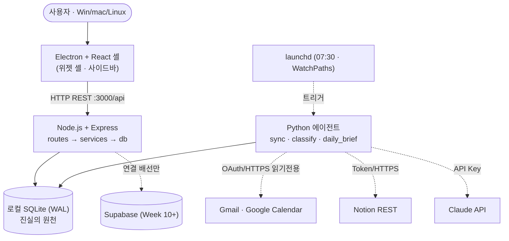

# 🔄 역 계획서 — 왜 만들었고, 어떻게 지었고, 무엇을 썼는가

> **이 문서는 [gamercross/my-setup-proj](https://github.com/gamercross/my-setup-proj) 의 `docs/REVERSE_PLAN.md` 를 이 저장소로 옮겨 보관한 사본이다.** 코드·ADR·나머지 문서의 원본은 여전히 원 저장소에 있으며, 아래 링크는 전부 그쪽을 가리킨다. 정돈된 읽기용 페이지는 [reverse-plan.html](reverse-plan.html) · 쇼케이스는 [index.html](index.html).
>
> 이미 만들어진 시스템을 거꾸로 되짚어 기반을 세우는 문서.
> **원초적 고민 → 의사결정 문제 → 문제해결방법 → 설계 → 서비스** 순서로 읽는다.
>
> **📂 이동:** [⬆ docs/](https://github.com/gamercross/my-setup-proj/blob/main/docs/README.md) · [ONBOARDING.md](https://github.com/gamercross/my-setup-proj/blob/main/docs/ONBOARDING.md) · [product/vision/VISION.md](https://github.com/gamercross/my-setup-proj/blob/main/docs/product/vision/VISION.md) · [product/vision/PERSONAL_OS.md](https://github.com/gamercross/my-setup-proj/blob/main/docs/product/vision/PERSONAL_OS.md) · [progress/PROGRESS.md](https://github.com/gamercross/my-setup-proj/blob/main/docs/progress/PROGRESS.md)
>
> **단일 원천:** 실제 진행 상태는 [progress/PROGRESS.md](https://github.com/gamercross/my-setup-proj/blob/main/docs/progress/PROGRESS.md) ·
> [product/requirements/TRACEABILITY.md](https://github.com/gamercross/my-setup-proj/blob/main/docs/product/requirements/TRACEABILITY.md) · `git log`.
> 결정의 원천은 [product/architecture/adr/](https://github.com/gamercross/my-setup-proj/blob/main/docs/product/architecture/adr/README.md). 이 문서는 그것들을
> 하나의 서사로 엮은 상위 뷰이며, 세부와 어긋나면 원천 문서가 맞다.

- 작성: 2026-09-09 (P0~P9 완료 시점의 회고)
- 배경: 우송대학교 2026-2학기 3개 강의(AI 컴퓨터 운영체제 실습 / AI시대 소프트웨어공학 /
  AITool 기반 소프트웨어공학)의 공통 실습 환경이자 제출 산출물. 강의별 렌즈는
  [progress/COURSE_MAPPING.md](https://github.com/gamercross/my-setup-proj/blob/main/docs/progress/COURSE_MAPPING.md).
- 공유용 아티팩트: https://claude.ai/code/artifact/dbf90a7a-fbcd-4708-a60a-9ca230028a55

---

## 1. 원초적 고민 — 무엇이 문제였나

### 1-0. 중심 줄기: 경험을 지식으로, 지식을 역량으로 — 그 방향을 한눈에

**2026-09-14 재정의.** 진척 가시성("내가 뭐가 진척되는지 감이 안 온다")은 이 프로젝트가
붙잡고 있던 증상이었지 목적이 아니었다. 사용자가 직접 바로잡은 문장이 이 문서의 진짜
중심 줄기다:

> **"우리의 목적은 진척도를 보는 것이 아닌, 자신의 프로젝트나 경험들이 모인 지식을
> 시각화하고 도식화해서 지식 가치를 올리는 것. 지식들이 모여서 자신의 역량을 증진시키고
> 그 방향을 빠르게 한눈에 보이게 하는 것."**
> **"목적의 근간은 자기계발을 더욱 효과적으로, 그리고 경험에 대한 지식을 구체화하고
> 가치 형성을 위해서 이루어진다."**
> — 사용자 진술, 2026-09-14

즉 이 프로젝트가 다루는 대상은 **완료율이 아니라 지식**이다. 할일·프로젝트·OKR·에이전트
활동·문서는 전부 "무엇을 겪었고 그로부터 무엇을 알게 됐는지"가 흩어지지 않고 쌓여
보이게 하는 그릇이며, 그 축적이 역량으로 이어지는 방향을 한눈에 보여 주는 것이
목적이다. "진척이 안 보인다"는 이 더 근본적인 결핍이 가장 먼저 만져진 표면이었을 뿐이다
(2026-09-09 인터뷰):

> "내가 뭐가 진척되는지 감이 안 와서." — 최초 인터뷰, 2026-09-09 (§1-0 이전 판)

이 감각은 **세 영역에서 같이** 나타났다 — 지식이 쌓이는 자리가 셋으로 흩어져 있다는
뜻이기도 하다:

1. **개인 삶·일 전반** — 이번 주에 내가 뭘 겪었고 거기서 뭘 배웠는지.
2. **공부·강의 진도** — 3개 강의에서 쌓이는 지식이 어디로 가는지.
3. **이 프로젝트 자체의 개발 진도** — P0~P9 를 지나며 쌓인 결정·경험이 무엇을 남겼는지.

그래서 이 프로젝트의 메타 문장은 이렇게 다시 읽는다:
**"이 저장소의 `PROGRESS.md` 가 프로젝트에 해 주는 일 — 흩어진 작업을 하나의 지식
서사로 엮는 일 — 을, 앱이 사용자 자신의 경험에도 해 준다"**
([PERSONAL_OS.md](https://github.com/gamercross/my-setup-proj/blob/main/docs/product/vision/PERSONAL_OS.md) T3·T6 메타). OKR·주간 플래너·기대정렬 체크인은
삶에서 쌓이는 지식과 역량의 방향을, 진행 현황·파일 탐색 뷰는 프로젝트 자신이 쌓은
지식(결정·근거·트레이드오프)을 같은 방식으로 보여 준다.

### 1-1. 파생 고민

`VISION.md` 의 최종 그림 — "흩어진 생산성 도구를 한 앱으로 통합하고, 매일 아침
AI 에이전트가 우선순위를 정리해 주는 데스크톱 셸" — 은 아래 불편들에서 나왔다.
사용자 확인 결과 **8개 모두 실제 고민과 부합**하며, 중심 줄기(경험의 지식화·역량 방향
가시화) 아래로 Q3·Q4·Q5·Q7 이 묶인다 — 당초 "진척 가시성" 으로 불렀던 묶음과 겉보기는
같지만, §1-0 재정의 이후로는 "완료율이 보이는가" 가 아니라 "쌓인 지식이 한곳에서
보이는가" 로 읽는다.

| # | 원초적 고민 | 구체적 증상 | 묶임 | 출처 |
|---|---|---|---|---|
| Q1 | 생산성 도구가 흩어져 있다 | 할일·프로젝트·일정·메일·브리핑을 앱마다 따로 확인한다 | 통합 | [VISION.md](https://github.com/gamercross/my-setup-proj/blob/main/docs/product/vision/VISION.md) §목표 |
| Q2 | 아침마다 우선순위 정리를 수동으로 한다 | "오늘 뭐부터 하지?" 를 매번 사람이 판단한다 | 자동 정리 | [VISION.md](https://github.com/gamercross/my-setup-proj/blob/main/docs/product/vision/VISION.md) 핵심기능 1 |
| Q3 | 같은 할 일이 여러 뷰에 중복되고 따로 논다 | 한 곳에서 완료해도 나머지 뷰가 안 따라온다 | **지식 가시화** | [PERSONAL_OS.md](https://github.com/gamercross/my-setup-proj/blob/main/docs/product/vision/PERSONAL_OS.md) §1 배경 1 |
| Q4 | 정리가 전부 수동이다 | 카테고리·주간 버킷·OKR 대비 진행률을 손으로 만들어야 보인다 | **지식 가시화** | [PERSONAL_OS.md](https://github.com/gamercross/my-setup-proj/blob/main/docs/product/vision/PERSONAL_OS.md) §1 배경 2 |
| Q5 | 에이전트가 일하는 게 안 보인다 | sync·브리핑·Notion 저장이 `sync_logs` 와 로그 파일에만 남는다 | **지식 가시화** | [PERSONAL_OS.md](https://github.com/gamercross/my-setup-proj/blob/main/docs/product/vision/PERSONAL_OS.md) §1 배경 3 |
| Q6 | 화면 배치가 고정이다 | 사용자마다 중요한 정보가 다른데 `Dashboard.jsx` 에 하드코딩돼 있다 | 개인화 | [DASHBOARD_OS.md](https://github.com/gamercross/my-setup-proj/blob/main/docs/product/vision/DASHBOARD_OS.md) §1 |
| Q7 | 프로젝트 구조·진행을 앱 안에서 못 본다 | 다이어그램·진행 본문이 저장소에만 있어 IDE 를 열어야 확인된다 | **지식 가시화** | [AS_IS.md](https://github.com/gamercross/my-setup-proj/blob/main/docs/product/vision/AS_IS.md) G9 |
| Q8 | 룩이 임시다 | 대부분 인라인 스타일 + 슬레이트 다크. 참조 틀이 있었지만 구현이 못 따라갔다 | 완성도 | [PERSONAL_OS.md](https://github.com/gamercross/my-setup-proj/blob/main/docs/product/vision/PERSONAL_OS.md) §1 배경 4 |

**갈망 신호 (사용자 진술).** "실제로 쓰면 가장 갈망할 기능" 을 물었을 때 고른 넷 —
**Daily Brief · 칸반+단일 완료 · OKR·주간 플래너 · 진행 현황·파일 탐색 뷰** — 은
전부 "쌓인 지식·경험을 대신 정리해 보여 주는" 축에 있다. 위젯 커스터마이즈·태그·캘린더는
갈망 목록에 없었다. 즉 개인화(Q6)·완성도(Q8)는 필요조건이지 목적이 아니다.

**원하는 최종 느낌 (사용자 진술).** Sunsama / Akiflow / 개인용 Linear 계열 —
차분하고 다듬어진, "내가 아무것도 안 해도 정리돼 있는" 생산성 도구.

**출발점의 현실 (AS-IS, 2026-09-02).** 한 줄 요약은
*"자동화 인프라(에이전트 팀·작업로그·CI)는 동작하지만, 제품 기능(프론트·백엔드·DB·에이전트)은
전부 골격 단계이며 서로 연결돼 있지 않다"* 였다. 이때 정리한 갭이 G1(React 미연결)~G9(앱 내
구조 확인 불가)이며, 이 역 계획서의 §5 서비스 목록은 그 갭을 하나씩 메운 기록이다.

**제약 조건 (`CONSTRAINTS.md`).** 개발자 1인(C-1), 마감 2026-11-30(C-2), 강의 A 진도 종속(C-3),
비용 0 목표(C-4), 학습·발표 산출물(C-5), GitHub 공개 저장소라 시크릿·개인정보 커밋 금지(C-6).
개발 머신은 macOS(Apple Silicon), 배포 목표는 Win/mac/Linux 3-OS, 오프라인 조회 동작 필수.
이 제약들이 아래 모든 의사결정의 배경이다.

---

## 2. 의사결정 문제 — 어떤 갈림길을 어떻게 골랐나

모든 아키텍처 결정은 **하나의 결정 = 하나의 ADR 파일** 로 남겼다(현재 33건). 각 ADR 은
`맥락 / 결정 / 근거 / 대안 / 결과·트레이드오프` 5필드를 갖는다. 여기서는 묶어서 서술한다.

### 2-1. 기반 스택 (ADR-0001~0009·0011·0012·0018) — "무엇으로 짓나"

| 결정 | 선택 | 대안(기각) | ADR |
|---|---|---|---|
| 프론트 렌더링 | React + Vite 로 통일 | 바닐라 `renderer.js` 유지 | [0001](https://github.com/gamercross/my-setup-proj/blob/main/docs/product/architecture/adr/ADR-0001-frontend-react-vite.md) |
| 로컬 DB | better-sqlite3 (동기 API, WAL) | `node:sqlite`, 순수 JS, 인메모리 | [0002](https://github.com/gamercross/my-setup-proj/blob/main/docs/product/architecture/adr/ADR-0002-local-db-better-sqlite3.md) |
| 스키마 관리 | `schema.sql` 1파일 + `IF NOT EXISTS` | 마이그레이션 도구, ORM | [0003](https://github.com/gamercross/my-setup-proj/blob/main/docs/product/architecture/adr/ADR-0003-schema-single-file.md) |
| 프론트 ↔ 백엔드 | 로컬 HTTP REST (`:3000/api`) | Electron IPC 직결, GraphQL | [0004](https://github.com/gamercross/my-setup-proj/blob/main/docs/product/architecture/adr/ADR-0004-front-back-http-rest.md) |
| 상태관리 | zustand, 도메인별 스토어 분리 | Redux, Context | [0005](https://github.com/gamercross/my-setup-proj/blob/main/docs/product/architecture/adr/ADR-0005-state-zustand.md) |
| 외부 API 소유 | Python 에이전트가 전담(읽기 전용) | 백엔드가 직접 호출 | [0006](https://github.com/gamercross/my-setup-proj/blob/main/docs/product/architecture/adr/ADR-0006-agent-owns-external-apis.md) |
| 스케줄러 | launchd(mac) / cron(Linux) | APScheduler 상주, 백엔드 타이머 | [0007](https://github.com/gamercross/my-setup-proj/blob/main/docs/product/architecture/adr/ADR-0007-schedule-launchd-cron.md) |
| 클라우드 동기화 | Week 10 이후로 연기 | 처음부터 Supabase 우선 | [0008](https://github.com/gamercross/my-setup-proj/blob/main/docs/product/architecture/adr/ADR-0008-supabase-deferred.md) |
| DB 파일 위치 | `DATABASE_PATH` 주입(기본 `backend/data/app.db`) | 코드 상수 | [0009](https://github.com/gamercross/my-setup-proj/blob/main/docs/product/architecture/adr/ADR-0009-sqlite-file-location.md) |
| 에이전트–백엔드 DB | 같은 SQLite + WAL, **쓰기 주체 분리** | 에이전트가 백엔드 API 경유 | [0011](https://github.com/gamercross/my-setup-proj/blob/main/docs/product/architecture/adr/ADR-0011-agent-backend-db-access.md) |
| 할일–프로젝트 링크 | `tasks.project_id` FK `ON DELETE SET NULL` | 조인 테이블, 링크 없음 | [0012](https://github.com/gamercross/my-setup-proj/blob/main/docs/product/architecture/adr/ADR-0012-task-project-link.md) |
| 스키마 마이그레이션 | 최소안: `PRAGMA user_version` + 인라인 러너 | 별도 마이그레이션 프레임워크 | [0018](https://github.com/gamercross/my-setup-proj/blob/main/docs/product/architecture/adr/ADR-0018-schema-migration-strategy.md) |

**툴 애착 (사용자 진술).** 스택 대부분은 강의 A 진도와 무난한 기본값을 따랐지만, **Electron**
(데스크톱 크로스플랫폼)은 사용자가 의식적으로 고른 지점이다 — 산출물은 **웹이 아니라 "앱"**
이어야 한다. 웹 데모([0026](https://github.com/gamercross/my-setup-proj/blob/main/docs/product/architecture/adr/ADR-0026-web-demo-mode.md))는 어디까지나 미리보기이며, 이 구분은
[NEXT_SESSION.md](https://github.com/gamercross/my-setup-proj/blob/main/docs/progress/NEXT_SESSION.md) §4-3 "웹 데모 ≠ 앱" 으로 이어진다.

핵심 원칙은 **로컬 우선 + 프로세스 분리**(제안 [0015](https://github.com/gamercross/my-setup-proj/blob/main/docs/product/architecture/adr/ADR-0015-local-first-architecture.md)):
로컬 SQLite 가 진실의 원천이고, 외부 API 는 그 위에 얹는 캐시이며, 렌더러는 시크릿·Node 에
접근하지 못하고(`contextIsolation`) 모든 데이터는 REST 로만 흐른다.

### 2-2. 대시보드 OS 전환 (ADR-0020~0022, DO-1~6) — "고정 패널을 왜 버렸나"

Q6 에 대한 답. `Dashboard.jsx` 한 컴포넌트가 모든 패널을 하드코딩하면서 비대해졌고
([DESIGN.md](https://github.com/gamercross/my-setup-proj/blob/main/docs/product/architecture/DESIGN.md) §1 우려), 사용자별 배치도 불가능했다. 그래서:

- **위젯 셸 아키텍처** — `react-grid-layout` 기반 그리드에 위젯 인스턴스를 배치·이동·리사이즈.
  새 기능 = `widgets/registry.js` 에 항목 추가(플러그인 유사). ([0020](https://github.com/gamercross/my-setup-proj/blob/main/docs/product/architecture/adr/ADR-0020-widget-shell-architecture.md))
- **레이아웃 영속화** — `localStorage`(`dashboard.layout.v1`, 300ms 디바운스) → 나중에 SQLite → 사용자별. ([0021](https://github.com/gamercross/my-setup-proj/blob/main/docs/product/architecture/adr/ADR-0021-widget-layout-persistence.md))
- **위젯별 테마** — 스코프된 CSS 커스텀 프로퍼티(`--w-*`) + 화이트리스트 config. 외부 코드 실행 없음(NFR-SEC-04). ([0022](https://github.com/gamercross/my-setup-proj/blob/main/docs/product/architecture/adr/ADR-0022-per-widget-theming.md))
- 착수 전 6개 질문(DO-1~6): 그리드 스냅(DO-1), 타입당 1인스턴스(DO-2), `localStorage` 1차(DO-3),
  config 검증은 프론트만(DO-4), 편집 토글 필요(DO-5), 다이어그램도 위젯화(DO-6).

강의 A 정합도 근거였다 — 과목명이 "AI **컴퓨터 운영체제** 실습" 이고, 위젯 셸은
미니 윈도우 매니저(창 생명주기·z-order·포커스·레이아웃 영속화)의 실습 대상이 된다.

#### 결정 서사 — Q6(개인화)와 강의의 관계 (솔직한 기록)

§1-1 에서 개인화(Q6)는 "필요조건이지 목적이 아니다" 라고 적었다. 그런데 위젯 셸은
프로젝트에서 가장 큰 코드 덩어리 중 하나다(C5·C6·P4.5 세 단계). 왜 목적도 아닌 것에
그만큼 썼나 — **강의 A 때문이다.**

- 과목명이 "AI 컴퓨터 운영체제 실습" 이고, 커리큘럼에 창·프로세스·포커스·레이아웃 관리가
  들어 있다. 고정 대시보드로는 그 주제를 실습 산출물로 보여 줄 수 없었다.
- 즉 위젯 셸은 **제품 필요(사용자마다 다른 배치)와 강의 필요(윈도우 매니저 개념 실습)가
  겹친 지점** 이라 크게 투자했다. 사용자 갈망 목록에 커스터마이즈가 없다는 사실(§1-1)은,
  이 투자가 제품 관점에서는 과했을 수 있음을 인정하는 신호다 — §5-2 재검토 노트로 이어진다.
- 반대로 다른 개인 OS 결정(라이트 테마·OKR 모델·마크다운 렌더)은 오래 고민하지 않았다.
  PO 질문으로 갈래를 좁힌 뒤 초안대로 갔다. 유일하게 며칠 붙잡은 건 PO-3(아래)이다.

### 2-3. 개인 생산성 OS 방향 (ADR-0027~0032, PO-1~14) — "다듬기 단계에서 정한 것"

Phase D 완료 후 사용자가 제시한 방향([PERSONAL_OS.md](https://github.com/gamercross/my-setup-proj/blob/main/docs/product/vision/PERSONAL_OS.md)). 열린 질문 PO-1~14 를
먼저 닫고 ADR 로 못박은 뒤 빌드했다.

| 결정 | 선택 | 대안(기각) | ADR / PO |
|---|---|---|---|
| 기본 테마 | 라이트 오프화이트 기본, 다크는 `[data-theme=dark]` 프리셋 | 다크 유지 | [0027](https://github.com/gamercross/my-setup-proj/blob/main/docs/product/architecture/adr/ADR-0027-light-theme-default.md) / PO-1·2 |
| 강조색 | 차분한 파랑 `#2f6feb` | 참조 화면의 보라 | 0027 / PO-2 |
| 뷰 데이터 일관성 | 단일 클라이언트 캐시(`id` 키잉), 뷰는 파생만 | 뷰마다 재 fetch | [0028](https://github.com/gamercross/my-setup-proj/blob/main/docs/product/architecture/adr/ADR-0028-single-client-cache.md) / PO-7 |
| 칸반 | `tasks` 위젯 안의 리스트/보드 토글(`config.display.view`) | 별도 위젯 타입 | 0028 §결정4 / PO-7 |
| 자동 분류 taxonomy | 자유 태그·다중(`task_tags` 조인), `tasks.category` 폐기 | 고정 카테고리 집합 | [0029](https://github.com/gamercross/my-setup-proj/blob/main/docs/product/architecture/adr/ADR-0029-task-auto-category.md) / PO-3 |
| 분류 시점·주체 | 에이전트 배치(일일 브리핑 시 1회 Claude 호출). 백엔드 POST 경로엔 Claude 없음 | 저장 시마다 분류 | 0029 / PO-4 |
| OKR 모델 | 1급 엔티티 `objectives`/`key_results`/`kr_snapshots` 3테이블 | `projects` 재해석 | [0030](https://github.com/gamercross/my-setup-proj/blob/main/docs/product/architecture/adr/ADR-0030-okr-data-model.md) / PO-5 |
| 주간 요약 | 순수 SQL 집계(`due_date` ISO 주 3버킷) | Claude "Weekly Brief" | 0030 / PO-6 |
| 차트 라이브러리 | 인라인 SVG (`dataviz` 스킬) | Recharts 도입 | PO-8 |
| 마크다운 렌더 | 서버에서 의존성 0 토큰화 → JSON. 파서·`dangerouslySetInnerHTML` 없음 | 마크다운 파서 + HTML 주입 | [0031](https://github.com/gamercross/my-setup-proj/blob/main/docs/product/architecture/adr/ADR-0031-safe-markdown-render.md) / PO-11 |
| 파일 트리 범위 | 허용 루트 = `docs/` + 루트 `*.md`. `.md` 만 렌더, 소스 제외 | 전 소스 트리 노출 | 0031 / PO-12 |
| 셸 형태 | 왼쪽 사이드바 + 주제별 위젯 레이아웃(`activeTopic`) | 단일 그리드 유지 | [0032](https://github.com/gamercross/my-setup-proj/blob/main/docs/product/architecture/adr/ADR-0032-sidebar-shell-per-topic-layouts.md) / PO-13·14 |
| 에이전트 "지금 실행" | 전용 디렉터리 파일 플래그 + launchd WatchPaths. subprocess 없음 | 백엔드가 python 직접 spawn | [0013](https://github.com/gamercross/my-setup-proj/blob/main/docs/product/architecture/adr/ADR-0013-dashboard-agent-queue.md) 부분채택 / PO-9 |

#### 결정 서사 — PO-3: 자유 태그 vs 고정 카테고리

ADR 표에서는 한 줄이지만, 실제로 가장 오래 붙잡은 갈림길이다. 표면 질문은 "분류 체계를
고정 집합으로 둘까, 자유 태그로 둘까" 였지만, 사용자를 실제로 멈춰 세운 건 그 아래의 불안이었다:

> **"에이전트가 내가 달아 둔 태그를 침범하면 어쩌지."**

일일 브리핑 배치가 태그 없는 할 일을 Claude 로 자동 분류하는데(PO-4), 이 배치가 사용자가
손으로 붙인 태그를 **덮어쓰거나 지울 가능성** 이 걱정이었다. 자동화가 사용자의 의도를
조용히 훼손하는 건, 이 프로젝트가 피하려는 바로 그 패턴이다.

- **고민한 대안들.** ① 고정 카테고리 집합 — 그래프·통계를 내기엔 깔끔하지만 "정리된 느낌"이
  사용자 생각과 안 맞았다. ② 자유 태그지만 에이전트는 분류 금지(수동만) — 안전하지만 Q4(자동
  정리)를 포기하는 것. ③ 자유 태그 + 에이전트 배치 + **출처 구분**.
- **결정.** ③. `task_tags` 조인 테이블에 `source ∈ {user, agent}` 컬럼을 두고,
  에이전트는 **`source='user'` 행을 절대 건드리지 않는다.** 태그 없는 할 일에만, `source='agent'`
  로만 추가한다. 사용자가 한 번이라도 손댄 할 일은 배치 대상에서 빠진다.
- **부수 결정.** 기존 스키마·코드에 있던 `tasks.category` 단일 컬럼을 **폐기**하고 조인으로
  옮겼다(다중 태그를 위해). 이건 [ADR-0018](https://github.com/gamercross/my-setup-proj/blob/main/docs/product/architecture/adr/ADR-0018-schema-migration-strategy.md) 최소 마이그레이션
  전략(`PRAGMA user_version` 인라인 러너)을 처음으로 실제로 쓴 사례가 됐다.
- **트레이드오프.** 태그별 통계·자동완성은 아직 없다(후속). `source` 값은 스키마 CHECK 로
  강제되지만, "사용자 태그가 붙은 할 일은 에이전트가 안 건드린다" 는 행 단위 불변식을
  지키는 책임은 `agent/db.py:add_agent_tags` + `classify.py` 에 있다 — 트리거가 아니라
  코드 가드라는 점은 §4-5 S3 로 이어진다.

결정: [ADR-0029](https://github.com/gamercross/my-setup-proj/blob/main/docs/product/architecture/adr/ADR-0029-task-auto-category.md) 채택 (2026-09-08, P6). 요구사항 FR-TASK-08.

### 2-4. 아직 안 정한 것 (제안 상태)

- [0013](https://github.com/gamercross/my-setup-proj/blob/main/docs/product/architecture/adr/ADR-0013-dashboard-agent-queue.md) 전체 작업 큐(FR-AGENT-09) — "지금 실행" 트리거만 채택, 큐는 미결
- [0015](https://github.com/gamercross/my-setup-proj/blob/main/docs/product/architecture/adr/ADR-0015-local-first-architecture.md) 아키텍처 스타일 명문화 · [0016](https://github.com/gamercross/my-setup-proj/blob/main/docs/product/architecture/adr/ADR-0016-desktop-process-topology.md) 2~4항 — 데스크톱 프로세스 토폴로지(패키징 시 백엔드 실행 주체·재기동·포트 폴백) · [0017](https://github.com/gamercross/my-setup-proj/blob/main/docs/product/architecture/adr/ADR-0017-rest-error-contract.md) REST 오류 계약(RFC 9457) · [0019](https://github.com/gamercross/my-setup-proj/blob/main/docs/product/architecture/adr/ADR-0019-architecture-fitness-functions.md) 피트니스 함수
- [0033](https://github.com/gamercross/my-setup-proj/blob/main/docs/product/architecture/adr/ADR-0033-standalone-widget-windows.md) 독립 위젯 창 — 방향만 유지, 구현 보류
- PO-10 — 개인 OS 방향(P8~P9)과 Phase E(다중 사용자·Supabase)의 순서

---

## 3. 문제해결방법 — 어떤 절차로 일했나

### 3-1. 문서 우선 순서: 문제 → 요구사항 → 결정 → 디자인 → 빌드

각 역량 테마(개인 OS 의 T1~T6)는 P0(문서) → P1(ADR·요구사항) → P2(디자인 캔버스) → P3~P9(빌드)
순서로 진행했다. "왜·무엇" 은 vision 문서가, "어떻게" 는 ADR·요구사항이, 목표 화면은
Claude Design 캔버스(6 아트보드)가 담당한다.

### 3-2. 에이전트 파이프라인 (`/feature`)

**의도 (사용자 진술).** 개발자가 1인(C-1)이라 **혼자서 내지 못하는 속도를 보완**하려고
파이프라인을 세웠다. 부수 효과로 강의 B(AI 지원 개발 프로세스) 실습과 품질 게이트(자기검열
강제)를 겸한다.

모든 코드 작업은 4역할 에이전트 파이프라인 1회로 완성한다. 오케스트레이터는 직접 코딩하지 않는다.

```
planner → developer → supervisor (최대 2회) → finisher
 계획      구현         리뷰 + 테스트 PASS/FAIL    검증·커밋·푸시
```

- 명시적 **상태 그래프**로 정의([ORCHESTRATION.md](https://github.com/gamercross/my-setup-proj/blob/main/docs/setup/ORCHESTRATION.md) §2): `SELECT→GATE→PLAN→BUILD→REVIEW→FINISH→REPORT`
  + 정지 상태 6종(`STOP_DECISION` 등). 사람 결정이 필요한 지점에서만 멈춘다.
- 불변 규칙: 한 번에 한 에이전트만 활성 · REVISE 최대 2회 · **커밋은 finisher 만** ·
  실행돼 FAIL 난 검사가 있으면 커밋 금지 · 정지 상태에서 임의 진행 금지 · 각 전이마다 Slack 한 줄.
- `/build-next` 는 이 파이프라인을 로드맵 위에서 반복 실행(다음 스텝 자동 선택).

### 3-3. 가드레일 (Claude Code 훅 — `.claude/settings.json`)

| 훅 | 시점 | 동작 | 스크립트 |
|---|---|---|---|
| SessionStart | 세션 시작 | 병합된 로컬 브랜치 자동 정리 | `scripts/prune-merged-branches.sh` |
| Stop | 매 턴 종료 | `작업로그.md` 오늘 커밋 섹션 재생성 | `scripts/worklog.sh` |
| PreToolUse (Edit\|Write) | 파일 편집 직전 | `main` 브랜치에서 코드 소스 편집 시 승인 프롬프트 | `scripts/hook-code-branch-guard.sh` |

### 3-4. 검증 게이트

`verify.sh`(49/0/0) · `verify.sh --code-only`(41/0/0) · `check-docs.sh`(문서 정합 11/0/0) ·
backend `npm test`(142) · frontend `node --test`(106) · agent `pytest -m "not network"`(80) ·
`npm run build` / `build:demo`. FAIL 하나라도 있으면 커밋하지 않고, SKIP 은 커밋 메시지에 명시.

### 3-5. 브랜치·PR

`feature/<주제> → PR → main`. Git Flow·`develop` 미채택([0023](https://github.com/gamercross/my-setup-proj/blob/main/docs/product/architecture/adr/ADR-0023-branch-model.md), 1인 프로젝트라 오버헤드 대비 이득 없음).
`main` 직접 커밋·force push 금지. **PR 병합은 사람이** 한다.

### 3-6. 설계 문서 방법론

C4/arc42 방식으로 뷰를 나눈다 — 드라이버 / 컨텍스트·컨테이너 / 컴포넌트 / 런타임 /
데이터 / 횡단 관심사 / 배포 / 진화 / 결정 이력. 요구사항은 FR·NFR·TRACEABILITY·TEST_PLAN 으로,
강의 대응은 COURSE_MAPPING 으로 추적한다.

---

## 4. 설계 — 결과 구조

### 4-1. 컨테이너 3개 + 저장소



### 4-2. 레이어

- **프론트**: `widgets/views/*WidgetView.jsx` → 도메인 store(zustand: `useTaskStore`·`useProjectStore`·
  `useCalendarStore`·`useOkrStore`·`useAgentStore`·`useLayoutStore`·`useUiStore`) → `api/client.js`.
  셸: `AppShell → Sidebar / TopicView → WidgetShell → WidgetHost(react-grid-layout) → WidgetFrame → 뷰`.
- **백엔드**: `server.js → routes/api.js → routes/* → services/* → db.js → db/index.js(커넥션 싱글턴) → schema.sql`.
  수명주기 핸들러(`lifecycle.js`) — 미처리 예외 로그 후 안전 종료, SIGTERM/SIGINT graceful shutdown + WAL 체크포인트.
- **에이전트**: `trigger.py → sync.py → services/{gmail,calendar}.py → agent/db.py`,
  `daily_brief.py → classify.py → services/{claude,notion}.py`.

### 4-3. 데이터 모델

초기 6테이블 — `projects` · `tasks` · `calendar_events` · `emails` · `briefs` · `sync_logs`
(날짜는 전부 `TEXT` + ISO8601). 개인 OS 에서 추가 — `task_tags`(source ∈ {user,agent}) ·
`objectives` · `key_results` · `kr_snapshots`. 마이그레이션은 `PRAGMA user_version` 인라인 러너.
스키마의 단일 원천은 [`backend/db/schema.sql`](https://github.com/gamercross/my-setup-proj/blob/main/backend/db/schema.sql), 필드 설명은
[DATA_DICTIONARY.md](https://github.com/gamercross/my-setup-proj/blob/main/docs/product/reference/DATA_DICTIONARY.md).

### 4-4. 경계·횡단 관심사

- **에이전트 경계**: 외부 API 는 읽기 전용(ACL). 브리핑 저장만 Notion 에 씀. 백엔드와 SQLite 를
  공유하되 에이전트는 `task_tags` 쓰기만 예외 허용([0029](https://github.com/gamercross/my-setup-proj/blob/main/docs/product/architecture/adr/ADR-0029-task-auto-category.md)).
- **보안**: 렌더러에 시크릿·Node 노출 없음(`contextIsolation`). OAuth 토큰은 Fernet 암호화 JSON
  파일(`TOKEN_ENCRYPTION_KEY`, [0024](https://github.com/gamercross/my-setup-proj/blob/main/docs/product/architecture/adr/ADR-0024-oauth-token-storage.md)). 마크다운은 서버 토큰화 후 렌더 —
  파서·HTML 주입 없음([0031](https://github.com/gamercross/my-setup-proj/blob/main/docs/product/architecture/adr/ADR-0031-safe-markdown-render.md)).
- **오류**: `errors.js` — `ValidationError`/`NotFoundError` + SQLite 제약 위반 → 400/404/500 한국어.
- **웹 데모**: `VITE_DEMO` 빌드에서 `demoClient.js` 인메모리 목이 백엔드를 대체([0026](https://github.com/gamercross/my-setup-proj/blob/main/docs/product/architecture/adr/ADR-0026-web-demo-mode.md)), GitHub Pages 배포.
- **빈 결과**: 브리핑 없음은 404 가 아니라 `200 + { brief: null }`([0025](https://github.com/gamercross/my-setup-proj/blob/main/docs/product/architecture/adr/ADR-0025-brief-empty-response.md)).

### 4-5. 구조가 아직 감당 못 하는 지점

§4-1~4-4 는 지금 구조를 **있는 그대로** 그렸다. 이 절은 그 구조가 아직 감당하지 못하는
지점을 모은다 — 각 항목을 **원인(거슬러 올라가면 어느 §1 제약·§2 결정에서 왔나) →
영향(지금 무엇이 위험하거나 불편한가) → 설계 보완(구조를 어떻게 바꾸나)** 순으로 읽는다.
공통 원인은 하나다: **로컬 단일 사용자·1인 개발·마감(C-1·C-2)** 가정 아래에서
"지금은 안 해도 되는 것" 으로 미룬 것들이 대부분이며(로컬 우선 원칙 자체는 [0015](https://github.com/gamercross/my-setup-proj/blob/main/docs/product/architecture/adr/ADR-0015-local-first-architecture.md) 로
제안만 됐고 미명문화 상태), 다중 사용자(Phase E)·패키징 배포로 가면 되짚어야 한다.
이 절은 §4-1~4-4 스냅샷에 대한 주석이며, 실행 항목은 §6-2 가 추적한다. 2026-09-10 코드
리뷰 시점 판단이고, 해소되면 여기서 지운다.

**대조군 — 잘 막힌 곳.** 외부에 노출되는 유일한 "경로를 받는" 표면인 파일 트리·문서
뷰(§5 P9, [0031](https://github.com/gamercross/my-setup-proj/blob/main/docs/product/architecture/adr/ADR-0031-safe-markdown-render.md))는 `services/{tree,docs}.js` 에서 심링크 스킵·세그먼트별 `..` 검사·route
레이어 재디코드 금지(`%252e` 우회 차단)·`realpathSync` 루트 이탈 재확인·깊이·항목·1MB
상한으로 다층 방어한다 — 같은 마감 압박 아래에서도 여기는 미루지 않았다.

#### 보안 · 안전성

**S1 — 백엔드가 로컬 네트워크에 열려 있다.**
- *원인:* 프론트↔백엔드를 로컬 HTTP REST 로 잇고([0004](https://github.com/gamercross/my-setup-proj/blob/main/docs/product/architecture/adr/ADR-0004-front-back-http-rest.md)) 인증을 두지 않은 건
  로컬 단일 사용자 가정([0015](https://github.com/gamercross/my-setup-proj/blob/main/docs/product/architecture/adr/ADR-0015-local-first-architecture.md)) 아래 **의도한** 결정이다. 다만 `server.js` 의
  `app.listen(PORT, cb)` 가 host 인자 없이 전 인터페이스(`0.0.0.0`)에 바인딩되는 건 Express
  기본값을 그냥 둔 것이고, 되짚은 적 없다.
- *영향:* 같은 머신의 다른 프로세스뿐 아니라 **같은 Wi-Fi 의 다른 기기**가 `:3000/api` 로
  전체 데이터를 읽고 쓸 수 있다.
- *설계 보완:* `app.listen(PORT, '127.0.0.1')` 로 루프백 고정. 패키징 시 백엔드 실행 주체·포트와
  함께 [ADR-0016](https://github.com/gamercross/my-setup-proj/blob/main/docs/product/architecture/adr/ADR-0016-desktop-process-topology.md) 2항에서 못박는다.

**S2 — CORS 가 `Origin: null` 을 모든 빌드에서 허용한다.**
- *원인:* 패키징된 Electron 이 `file://` 에서 렌더러를 로드해(데스크톱 프로세스 토폴로지,
  [0016](https://github.com/gamercross/my-setup-proj/blob/main/docs/product/architecture/adr/ADR-0016-desktop-process-topology.md) 영역) `fetch` 가 `Origin: null` 을 보낸다. 이 예외를 `middleware/cors.js` 에
  환경 분기 없이 넣어서, 웹 데모([0026](https://github.com/gamercross/my-setup-proj/blob/main/docs/product/architecture/adr/ADR-0026-web-demo-mode.md))·개발 빌드까지 그대로 상속했다.
- *영향:* 브라우저에서 열린 샌드박스 iframe·로컬 HTML 파일도 동일한
  `Access-Control-Allow-Origin` 을 받는다.
- *설계 보완:* `null` 허용을 prod 패키지 빌드로 한정하는 환경 분기.

**S3 — 에이전트의 사용자 태그 비침범이 트리거가 아닌 코드로만 지켜진다.**
- *원인:* PO-3([0029](https://github.com/gamercross/my-setup-proj/blob/main/docs/product/architecture/adr/ADR-0029-task-auto-category.md), §2-3 서사)에서 "에이전트는 `source='user'` 행을 안 건드린다" 를
  정했다. `source` 값 자체는 스키마 CHECK(`source IN ('user','agent')`, `schema.sql`)로 강제되지만,
  "이미 사용자 태그가 붙은 할 일에는 에이전트가 손대지 않는다" 는 **행 단위 불변식**은
  최소 마이그레이션 전략([0018](https://github.com/gamercross/my-setup-proj/blob/main/docs/product/architecture/adr/ADR-0018-schema-migration-strategy.md))이 트리거를 피하는 방향이라 애플리케이션 층에 남았다.
- *영향:* `agent/db.py:add_agent_tags`(태그 0개인 할 일만 대상) + `classify.py`(환각 id 방어) +
  `get_untagged_tasks`(`NOT EXISTS` 필터)의 3중 가드가 뚫리거나 새 쓰기 경로가 생기면,
  자동화가 사용자 태그를 조용히 훼손하는 §2-3 이 우려하던 상황이 다시 열린다.
- *설계 보완:* "이미 `source='user'` 태그가 있으면 `source='agent'` INSERT 를 무시" 트리거를
  마이그레이션으로 추가. 침범 시도 회귀 테스트를 `agent` 스위트에 고정.

**S4 — OAuth 토큰 암호화 키에 회전 절차가 없다.**
- *원인:* 비용 0 목표(C-4) 아래 토큰을 Fernet 대칭키 1개로 암호화한 파일에 뒀다([0024](https://github.com/gamercross/my-setup-proj/blob/main/docs/product/architecture/adr/ADR-0024-oauth-token-storage.md)).
  키 회전·유출 대응은 학습·발표 산출물 범위(C-5)에서 빠졌다.
- *영향:* `TOKEN_ENCRYPTION_KEY` 하나가 유출되면 Gmail·Calendar 읽기 토큰 전부가 풀린다.
- *설계 보완:* 키 회전 런북, 유출 시 재인증 경로 문서화. (토큰 파일 권한 `0600` 은 이미
  `google_oauth.py` 에서 `chmod` 로 설정 중 — 회전만 남았다.)

**S5 — 시크릿 커밋 방지가 `.gitignore` 한 겹뿐이다.**
- *원인:* 공개 저장소라 시크릿·개인정보 커밋 금지(C-6)인데, 실제 방어는 `.gitignore` 와
  브랜치 가드 훅(`hook-code-branch-guard.sh`)뿐이다. 훅은 `main` 편집을 막는 용도지
  시크릿 스캐너가 아니다.
- *영향:* `.env` 는 무시되지만(확인됨), 패턴에서 벗어난 새 시크릿 파일은 그대로 커밋될 수 있다.
- *설계 보완:* pre-commit 시크릿 스캔(gitleaks 등) 훅 추가.

#### 기술 부채 · 품질

**D1 — 데모↔실서버 패리티가 "경로 존재" 까지만 자동화됐다.**
- *원인:* 웹 데모가 인메모리 목으로 백엔드를 대체하고([0026](https://github.com/gamercross/my-setup-proj/blob/main/docs/product/architecture/adr/ADR-0026-web-demo-mode.md)) "새 엔드포인트마다 목도
  같이 갱신" 을 수작업 규율로 뒀다. 커밋 `0a1435c` 가 그중 라우트 목록 집합 비교만 자동화했다.
- *영향:* 응답 스키마·상태코드·에러 봉투가 목과 실서버 사이에서 드리프트해도 CI 가 못 잡는다.
- *설계 보완:* 대표 엔드포인트 응답 형태를 스냅샷 비교하는 2단계를 `check-demo-parity.mjs` 에 추가.

**D2 — REST 오류가 단일 봉투(`{ error: "한국어" }`)다.**
- *원인:* 오류 계약(RFC 9457)을 [ADR-0017](https://github.com/gamercross/my-setup-proj/blob/main/docs/product/architecture/adr/ADR-0017-rest-error-contract.md) 로 제안만 하고, 마감(C-2) 앞에서 채택을 미뤘다.
- *영향:* 클라이언트가 검증 실패·미존재·서버 오류를 코드로 구분하지 못하고 메시지 문자열에 의존한다.
- *설계 보완:* [ADR-0017](https://github.com/gamercross/my-setup-proj/blob/main/docs/product/architecture/adr/ADR-0017-rest-error-contract.md) 채택 — problem+json 으로 `type`/`status` 분리.

**D3 — 레이어·경계 규칙에 자동 검사가 없다.**
- *원인:* 1인 개발(C-1)이라 "렌더러는 REST 로만", "에이전트는 외부 API 읽기 전용",
  "쓰기 주체 분리" 를 코드 리뷰로 갈음해 왔다.
- *영향:* 위 경계 중 하나가 리팩터링에서 깨져도 테스트가 통과할 수 있다 (S3 이 그 구체 사례).
- *설계 보완:* 피트니스 함수([0019](https://github.com/gamercross/my-setup-proj/blob/main/docs/product/architecture/adr/ADR-0019-architecture-fitness-functions.md), 제안 상태) 채택 — import 방향·금지 의존성을 CI 검사로.

**D4 — 수동 검증 백로그(TC-P3~P9-M)가 실행되지 않았다.**
- *원인:* 1인 개발(C-1)이라 수동 QA 시간이 빌드 시간과 경쟁한다. 자동 테스트는 유지했지만
  실제 Electron 앱 확인은 밀렸다.
- *영향:* P3~P9 기능이 자동 테스트는 통과하나, 통합된 앱에서 동작을 눈으로 확인한 기록이 없다.
- *설계 보완:* §6-2 로컬 수동 검증 백로그 — 통합 실행 스크립트(`scripts/dev.sh`) 위에서 일괄 소화.

---

## 5. 서비스 — 무엇을 만들었나

각 기능을 **왜(원초 고민) / 어떻게(핵심 구현·결정) / 툴 / 상태** 로 정리한다.
빌드 단계 명칭: B·C = 대시보드 OS 단계, D = 에이전트 단계, P = 개인 생산성 OS 단계.

| 기능 | 왜 (Q#) | 핵심 구현 | 툴·플러그인 | 단계 · 상태 |
|---|---|---|---|---|
| 할일 CRUD + `project_id` 링크 | Q1 | `routes/services/tasks.js`, `useTaskStore`, 낙관적 갱신+롤백 | Express, better-sqlite3, zustand | B3·C2 ✅ |
| 프로젝트 추적 + 진행바 | Q1 | `ProjectCard`·`ProjectForm`, 슬라이더 편집, `status ∈ {active,done,on_hold}` | zustand | C2 ✅ |
| 캘린더 위젯 | Q1 | `CalendarWidget`, `useCalendarStore`, `calendar_events` 캐시 | — | C3 ✅ |
| 다이어그램 뷰어 | Q7 | `DiagramPanel` + `GET /api/diagrams`(`docs/**/*.md` mermaid 파싱, 읽기 전용) | mermaid 11 (동적 import) | C4 ✅ |
| 위젯 셸 (배치·이동·리사이즈·레이아웃 저장) | Q6 | `WidgetShell/Host/Frame/Picker`, `useLayoutStore`, localStorage 영속(훼손 시 폴백), 위젯별 `ErrorBoundary` | react-grid-layout 2.2.4(`/legacy`), react-resizable | C5 ✅ |
| 위젯별 테마·표시 옵션 | Q8 | `WidgetSettings` 모달(createPortal), `themeToVars` 화이트리스트, `themePresets.js`, `configSchema` 자동 폼 | 스코프 CSS 변수 | C6 ✅ · [재검토 §5-2](#5-2-재검토-노트) |
| 사이드바 셸 + 주제별 레이아웃 | Q6, Q8 | `AppShell`·`Sidebar`·`TopicView`, `useUiStore.activeTopic`, 레이아웃 v1→v2 마이그레이션(기존 배치는 `overview`) | — | P4.5 ✅ (#45) |
| 라이트 비주얼 시스템 | Q8 | `styles.css` `:root` 팔레트 다크→라이트 + `[data-theme=dark]` 블록, 하드코딩 hex→`var(--*)` 치환(10파일) | — | P3 ✅ |
| 공통 컴포넌트 | Q8 | `StatTile`·`DotProgress`(+순수 `dotFill.js`)·`Chip`, `--card-radius` 16·`--shadow-card` | 인라인 SVG | P4 ✅ (#42) |
| 단일 캐시 + 칸반 뷰 | Q3 | `taskCache.js`, `useTaskStore` `byId`/`order` 정본 + `tasks` 파생 미러, `TaskBoard` 리스트/보드 토글 | zustand | P5 ✅ (#47) |
| 할일 자동 분류 (자유 태그) | Q4 | `task_tags` 테이블(`source ∈ {user,agent}`), `POST/DELETE /api/tasks/:id/tags`, `agent/classify.py` 배치, 태그 칩 + 필터 바 | Claude API (배치 1회/일) | P6 ✅ (#52) · 서사 §2-3 |
| 에이전트 활동 위젯 + "지금 실행" | Q5 | `GET/POST /api/agent/*`, `AgentActivityWidgetView`, `useAgentStore`, `agent/trigger.py`, `agent/.triggers/run-now` 플래그 | launchd WatchPaths, 파일 플래그 | P7 ✅ (#55) |
| OKR + 주간 플래너 + 라인차트 | Q4 | `objectives`/`key_results`/`kr_snapshots`, `GET /api/okr`·`/api/okr/trend`·CRUD·`GET /api/planner/weekly`, `kr_snapshots` 월별 적재는 백엔드 자체, 구글식 등급(`key_results.kind` committed/aspirational + `krGrade`/`objectiveGrade` 색상 밴드, ADR-0034) | 인라인 SVG `LineChart`(`linePath.js`) | P8 ✅ (#58) · 등급 ✅ (ADR-0034) |
| 진행 현황 · 파일 탐색 뷰 | Q7 | `GET /api/tree` + `GET /api/docs/:path`(의존성 0 토크나이저, `.md` 만, 상한 깊이 8·항목 2000·1MB, 심링크 스킵), `progress` 위젯(좌 트리/우 본문, 분할선 드래그·패널 접기·섹션 접기) | 파서·`dangerouslySetInnerHTML` 없음 | P9 ✅ (#59) |
| 기대정렬 체크인 (7질문 자기 점검) | Q4 | `expectation_checkins` 전용 테이블(자유 서술 7질문, 최소 1개 필수), `GET/POST/PUT/DELETE /api/checkins`, `CheckinWidgetView`·`useCheckinStore`(낙관적 갱신+롤백), 프로젝트/목표 선택 연결(느슨 FK) | zustand, better-sqlite3 | P10 ✅ (ADR-0035) |
| Daily Brief 에이전트 | Q1, Q2 | `sync.py`(수집) → `daily_brief.py`(생성) → Claude → `briefs`(date upsert) → Notion, `GET /api/brief/today` | anthropic SDK(`claude-sonnet-5`, thinking adaptive), launchd | D3 ✅ |
| Gmail·Calendar 실 수집 | Q1 | `agent/services/{gmail,calendar}.py`, OAuth 최초 로그인 → `emails`·`calendar_events` upsert 캐시 | google-api-python-client 2.200, google-auth-oauthlib 1.4, cryptography 50 (Fernet) | D2-b ✅ |
| Notion 브리핑 저장 | Q1 | `services/notion.py` REST 직접 호출, 미설정 시 스킵 | requests (`Notion-Version: 2022-06-28`) | D3 ✅ |
| 웹 데모 모드 | C-5 (발표) | `demoClient.js`/`demoData.js` 인메모리 목 어댑터, 새 엔드포인트마다 목도 같이 갱신 | Vite `VITE_DEMO`, GitHub Pages 자동 재배포 | ✅ ([0026](https://github.com/gamercross/my-setup-proj/blob/main/docs/product/architecture/adr/ADR-0026-web-demo-mode.md)) |
| 개발 파이프라인 (메타 기능) | C-1 (1인) | `.claude/agents/{planner,developer,supervisor,finisher}.md`, `/feature`·`/build-next`, 훅 3종, `worklog`·`slack-notify` | Claude Code, GitHub Actions CI, launchd, Slack webhook | Phase A ✅ |

### 5-1. 도구·플러그인 총목록

| 영역 | 스택 |
|---|---|
| 프론트 | Electron 27, React 18, Vite 7 + `@vitejs/plugin-react`, zustand 4, react-grid-layout 2.2.4, react-resizable 3.2, mermaid 11, concurrently · cross-env · wait-on, electron-builder |
| 백엔드 | Node (CI 22), Express 4, better-sqlite3 13, `@supabase/supabase-js` 2(연결 배선만), supertest, nodemon |
| 에이전트 | Python (CI 3.12 / 로컬 3.14), anthropic SDK ≥0.49, python-dotenv, google-api-python-client 2.200, google-auth-oauthlib 1.4, google-auth-httplib2, cryptography 50 (Fernet), requests (Notion REST), apscheduler, pytest |
| 자동화·운영 | Claude Code (서브에이전트 팀 + slash commands + hooks), GitHub Actions (`test.yml`: 문법 + `npm test` + `pytest -m "not network"`), launchd plist 3종(`dailybrief`·`runnow`·`worklog`), Slack incoming webhook, `verify.sh` · `check-docs.sh` |
| 디자인 | Claude Design 캔버스 — `design-p2/*.dc.html` 6 아트보드 (개요·할일·OKR·에이전트 활동·진행 현황·공통 컴포넌트) |
| 문서 방법론 | C4/arc42 뷰, ADR (결정 1개 = 파일 1개), FR/NFR/TRACEABILITY/TEST_PLAN, COURSE_MAPPING |

### 5-2. 재검토 노트

역 계획서라면 "만들었지만 다시 볼 것" 도 남긴다. 지금 시점의 판단이며, 바뀌면 여기 갱신한다.

| 기능 | 판단 | 사용자 진술 | 함의 |
|---|---|---|---|
| **위젯별 테마·표시 옵션 (C6)** | **유지하되 우선순위 낮음** | "유지는 되되 우선순위가 낮다" | 방향이 틀린 건 아니다 — 인프라(`themeToVars` 화이트리스트·`configSchema` 자동 폼·프리셋)는 재사용되고, 특히 **표시 옵션(display: 정렬·완료 숨김)** 은 실제로 쓰인다. 다만 **위젯별 색·모서리 커스터마이즈(theme)** 는 갈망 목록에 없었고(§1-1), 앞으로 다듬기 시간을 여기 더 쓰지 않는다. 전역 테마 1벌(라이트/다크)로 충분하다는 신호. 새 위젯을 낼 때 `theme` 탭을 확장하는 데 시간을 쓰지 말 것. |

이 노트가 커지면 별도 문서(`RETROSPECTIVE.md`)로 분리한다.

---

## 6. 타임라인과 다음 단계

### 6-0. 기대정렬로 보는 이 프로젝트 (2026-09-14)

**기대정렬**은 사용자가 자기 자신에게 반복 적용해 온 7문항 자기 점검 방법론이다 — 프로젝트를
향한 방법론이 ADR(§2)이라면, 자기 자신을 향한 방법론이 기대정렬이다. 여기서는 그 7문항을
**프로젝트 전체**에 적용해, 지금까지 만든 기능 하나하나가 어떤 질문에 대한 답인지 한 번에
훑는다 — §1~§5 에 흩어진 "왜"를 다시 한 곳에 모으는 절.

| 질문 | 답 |
|---|---|
| **내가 뭘 하고 있지?** | 할일·프로젝트·OKR·에이전트 활동·기대정렬 체크인을 하나의 위젯 셸에 모으는 로컬 우선 대시보드를 만들고 있다. |
| **이걸 왜 하지?** | 결과물이 아닌 경험(고교 시절 PC방 알바·영상 편집·3년 방송부)을 기록하기 어려웠고, Notion으로 시도했으나 파일이 많아지자 정리가 무너졌다. "혼자서 생각→행동→기록→정리를 전부 해내는 과정"이 너무 어려웠다는 것이 직접적 동기다(§1-0). |
| **언제까지 할 것인지?** | 고정 마감(2026-11-30, C-2)은 있지만, 진짜 종료 조건은 날짜가 아니라 상태다 — "내가 작업하는 모든 내용에 대해서 정리가 될 때까지." |
| **어떤 목표지?** | 진척률이 아니라 지식(§1-0 재정의) — 경험에서 나온 지식을 시각화·도식화해 가치를 올리고, 그 지식이 쌓여 역량이 느는 방향을 한눈에 보이게 하는 것. |
| **어떤 전략이지?** | 로컬 우선 + 위젯 셸(§4-1) · 결정 1건 = ADR 1건(§2) · 4역할 에이전트 파이프라인으로 1인 개발 속도 보완(§3-2) · OKR·기대정렬 체크인으로 자기 진단을 구조화. |
| **무엇을 구체적으로 할 것인지?** | §1-1 의 파생 문제(Q1~Q8) 하나하나에 §5 의 기능으로 답했다 — 할일 CRUD(Q1), 위젯 셸(Q6), 자동 분류(Q4), 에이전트 활동(Q5), OKR 구글 등급(Q4), 진행 현황 뷰(Q7), 기대정렬 체크인(자기 자신에 대한 Q4). |
| **어떤 상태인지?** | 1주차 프로토타입 → 2주차 역량 피드백 수용 → 3주차(지금) 기획서·보고서·쇼케이스 작성 및 소개. 코드 저장소 PR 65~68 진행 중, `docs/REVERSE_PLAN.md`·`REPORT.md`·쇼케이스 사이트에 이 서사를 공개했다. |

이 표 자체가 "기능에 의미를 부여"하는 절이다 — 위젯 하나하나는 독립된 완성품이 아니라
7문항 중 하나에 대한 구체적 응답이며, 다음 기능을 추가할 때도 "이게 7문항 중 어디에
답하는가"를 먼저 확인한다.

### 6-1. 진행 순서

```
Phase A (환경·자동화 인프라)
  → Phase B (Vite+React 마운트 B1, better-sqlite3 B2, 할일 배선 B3)
  → Phase C (CORS·로깅 C1, 프로젝트 C2, 캘린더 C3, 다이어그램 C4, 위젯 셸 C5, 위젯 커스터마이즈 C6)
  → Phase D (Google OAuth·실 수집 D2-b, Daily Brief·Notion D3)
  → 웹 데모 배포 (ADR-0026)
  → 개인 생산성 OS: P0 문서 → P1 ADR → P2 디자인 → P3 라이트 테마 → P4 공통 컴포넌트
     → P4.5 사이드바 셸 → P5 단일 캐시·칸반 → P6 자동 분류 → P7 에이전트 활동
     → P8 OKR·주간 플래너 → P9 진행 현황·파일 탐색 (#59 병합)
```

일정 근거는 [ROADMAP.md](https://github.com/gamercross/my-setup-proj/blob/main/docs/product/ROADMAP.md), Phase↔Week↔강의 대응은 [progress/COURSE_MAPPING.md](https://github.com/gamercross/my-setup-proj/blob/main/docs/progress/COURSE_MAPPING.md).

### 6-2. 남은 일

- **앱 통합** ([NEXT_SESSION.md](https://github.com/gamercross/my-setup-proj/blob/main/docs/progress/NEXT_SESSION.md) §4-3) — 통합 실행 스크립트 `bash scripts/dev.sh` ✅ ([ADR-0016](https://github.com/gamercross/my-setup-proj/blob/main/docs/product/architecture/adr/ADR-0016-desktop-process-topology.md) 1항 채택 2026-09-09).
  남은 것: ADR-0016 2~4항(패키징 시 백엔드 실행 주체·재기동·포트·**루프백 바인딩 §4-5 S1**)·다중 `BrowserWindow`
- **데모↔실서버 패리티** — 경로 집합 비교는 `scripts/check-demo-parity.mjs` 로 자동화됨(커밋 `0a1435c`).
  남은 것: 응답 스키마·상태코드 드리프트 검사(§4-5 D1)
- **로컬 수동 검증 백로그** — TC-P3~P9-M 을 실제 Electron 앱에서 확인해 `PROGRESS.md`·`TEST_PLAN.md` 반영(§4-5 D4)
- **보안 보완** — §4-5 S1~S5: 루프백 바인딩·CORS 환경 분기·태그 불변식 DB 제약·토큰 키 회전 런북·pre-commit 시크릿 스캔
- **미결 결정** — §2-4 참조 (제안 ADR 0015·0016 2~4항·0017·0019·0033 + PO-10)

---

## 7. 관련 문서

- [product/vision/VISION.md](https://github.com/gamercross/my-setup-proj/blob/main/docs/product/vision/VISION.md) · [PERSONAL_OS.md](https://github.com/gamercross/my-setup-proj/blob/main/docs/product/vision/PERSONAL_OS.md) · [DASHBOARD_OS.md](https://github.com/gamercross/my-setup-proj/blob/main/docs/product/vision/DASHBOARD_OS.md) — 제품 방향
- [AS_IS.md](https://github.com/gamercross/my-setup-proj/blob/main/docs/product/vision/AS_IS.md) · [CONSTRAINTS.md](https://github.com/gamercross/my-setup-proj/blob/main/docs/product/vision/CONSTRAINTS.md) · [RISKS.md](https://github.com/gamercross/my-setup-proj/blob/main/docs/product/vision/RISKS.md) — 출발점·제약·리스크
- [product/architecture/ARCHITECTURE.md](https://github.com/gamercross/my-setup-proj/blob/main/docs/product/architecture/ARCHITECTURE.md) · [DESIGN.md](https://github.com/gamercross/my-setup-proj/blob/main/docs/product/architecture/DESIGN.md) · [adr/README.md](https://github.com/gamercross/my-setup-proj/blob/main/docs/product/architecture/adr/README.md) — 구조·결정
- [setup/ORCHESTRATION.md](https://github.com/gamercross/my-setup-proj/blob/main/docs/setup/ORCHESTRATION.md) · [setup/AUTOMATION.md](https://github.com/gamercross/my-setup-proj/blob/main/docs/setup/AUTOMATION.md) — 개발 방법론
- [progress/PROGRESS.md](https://github.com/gamercross/my-setup-proj/blob/main/docs/progress/PROGRESS.md) · [product/requirements/TRACEABILITY.md](https://github.com/gamercross/my-setup-proj/blob/main/docs/product/requirements/TRACEABILITY.md) — 진행 상태 (단일 원천)
- [progress/NEXT_SESSION.md](https://github.com/gamercross/my-setup-proj/blob/main/docs/progress/NEXT_SESSION.md) · [product/ROADMAP.md](https://github.com/gamercross/my-setup-proj/blob/main/docs/product/ROADMAP.md) · [progress/COURSE_MAPPING.md](https://github.com/gamercross/my-setup-proj/blob/main/docs/progress/COURSE_MAPPING.md) — 다음 작업·일정·강의 대응
- [product/testing/TEST_PLAN.md](https://github.com/gamercross/my-setup-proj/blob/main/docs/product/testing/TEST_PLAN.md) — 테스트 계획 (수동 검증 백로그 포함)

---

**작성:** 2026-09-09 · **개정:** 2026-09-10 (§4-5 알려진 약점·보완 과제 추가) ·
2026-09-14 (§1-0 중심 줄기 재정의 — 진척 가시성 → 경험의 지식화·역량 방향 가시화)
